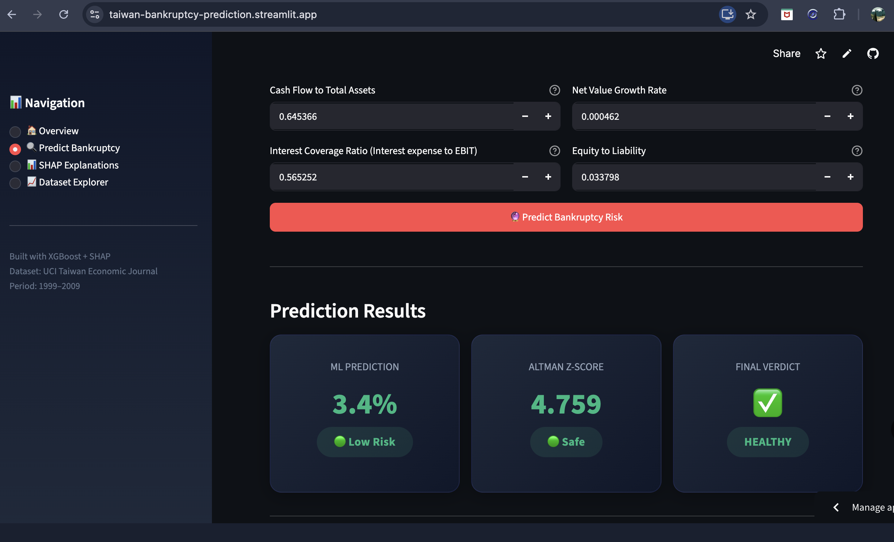

# Taiwan Bankruptcy Prediction

An XGBoost-powered corporate bankruptcy prediction system benchmarked against 
the classical Altman Z-Score, interpreted with SHAP, and deployed as an 
interactive Streamlit dashboard.

**[Live Demo](https://taiwan-bankruptcy-prediction.streamlit.app/)**

---

## Overview

Trained on 6,819 Taiwanese company filings (1999–2009), this system predicts 
bankruptcy risk from 95 financial ratios and explains every prediction using 
SHAP waterfall plots — making risk decisions auditable, not just accurate.

---

## Model Performance

| Model | ROC-AUC | PR-AUC | Recall (Bankrupt) |
|-------|---------|--------|-------------------|
| Altman Z-Score (1968) | 0.09 | — | 0% |
| Logistic Regression | 0.44 | 0.03 | 20% |
| Random Forest baseline | 0.94 | 0.48 | 23% |
| RF + SMOTE | 0.95 | 0.48 | 57% |
| **XGBoost + SMOTE (final)** | **0.94** | **0.52** | **68%** |

> Altman Z-Score fails on this dataset (ROC-AUC 0.09) — thresholds calibrated 
> for 1960s US manufacturing firms do not transfer to Taiwanese companies. 
> This validates the data-driven ML approach.

---

## Key Findings

- **Total debt/Total net worth** is the single strongest bankruptcy predictor — 
  leverage dominates over profitability signals
- **SMOTE** outperformed class weights for handling 97:3 class imbalance
- Optimal decision threshold tuned to **0.20** under credit risk context 
  (false negatives costlier than false positives)
- Altman Z-Score misclassified 6,813/6,819 companies as Safe — 
  confirming poor cross-market transferability

---

## Methodology

1. **EDA** — 95 features grouped into 7 financial categories 
   (Liquidity, Profitability, Leverage, Activity, Cash Flow, Growth, Per Share)
2. **Preprocessing** — Winsorization at 1st/99th percentile → RobustScaler
3. **Baseline** — Logistic Regression + Random Forest, no imbalance handling
4. **Imbalance handling** — SMOTE, class weights, threshold tuning
5. **Final model** — XGBoost with scale_pos_weight + threshold 0.20
6. **Benchmark** — Altman Z-Score (1968) manual implementation
7. **Explainability** — SHAP TreeExplainer, global + local waterfall plots

---

## Dataset

**UCI Taiwanese Economic Journal (Liang et al., 2016)**
- 6,819 companies × 95 financial ratio features
- Target: `Bankrupt?` — severely imbalanced (3.23% positive)
- Source: [UCI ML Repository](https://archive.ics.uci.edu/dataset/572/taiwanese+bankruptcy+prediction)

---

## Project Structure
