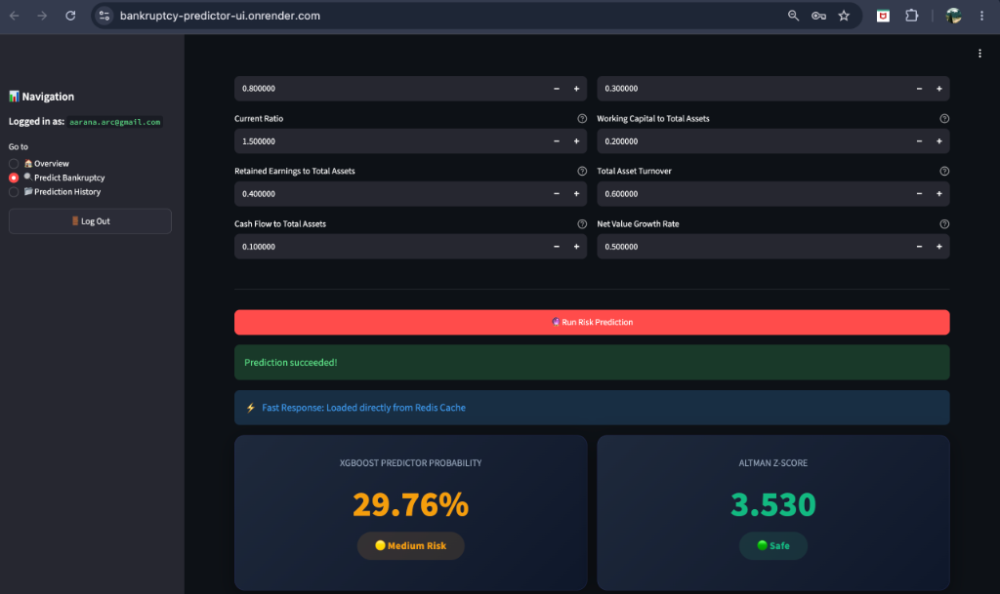

# Corporate Bankruptcy Prediction System

An XGBoost-powered corporate bankruptcy prediction system benchmarked against the classical Altman Z-Score, interpreted with SHAP, utilizing Redis caching, and integrated with Supabase database for user authentication and prediction history logging.

**[Live Demo Link](https://bankruptcy-predictor-ui.onrender.com/)**



---

## Architecture Overview

This decoupled application separates frontend presentation from model inference and database layers:

- **Streamlit UI**: Pure presentation layer. Communicates with the backend exclusively via JSON HTTP APIs with JWT bearer authentication.
- **FastAPI Backend**: Hosts the XGBoost classifier pipeline, handles password hashing and JWT validation, interacts with Supabase, and manages Redis caching.
- **Redis Cache**: Caches predictions to bypass model inference for identical inputs.
- **Supabase Postgres**: Stores hashed user credentials and historical predictions.

---

## Model Performance

| Model | ROC-AUC | PR-AUC | Recall (Bankrupt) |
|-------|---------|--------|-------------------|
| Altman Z-Score (1968) | 0.09 | — | 0% |
| Logistic Regression | 0.44 | 0.03 | 20% |
| Random Forest baseline | 0.94 | 0.48 | 23% |
| RF + SMOTE | 0.95 | 0.48 | 57% |
| **XGBoost + SMOTE (final)** | **0.94** | **0.52** | **68%** |

> **Note**: Altman Z-Score fails on this dataset (ROC-AUC 0.09) because thresholds calibrated for 1960s US manufacturing firms do not directly transfer to Taiwanese firms. This highlights the necessity of a modern data-driven ML approach.

---

## Project Structure

```text
app/
├── __init__.py
├── main.py                     # Entry point combining routers, middlewares, and CORS
├── models/
│   ├── model.joblib            # Serialized XGBoost ML model
│   └── robust_scaler.pkl, winsorize_bounds.pkl, etc.
├── api/
│   ├── routes_predict.py       # Predict endpoints with Redis & Supabase prediction logging
│   └── routes_auth.py          # /auth/signup & /auth/login with Supabase users
├── core/
│   ├── config.py               # Env var loading via dotenv
│   ├── security.py             # Password hashing (bcrypt) & JWT token helpers
│   ├── dependencies.py         # DB (Supabase client) and Current User retrieval
│   └── exceptions.py           # Custom exception handler classes
├── services/
│   └── model_service.py        # Pipeline: load artifacts, winsorize, scale, predict, compute Altman Z
├── middleware/
│   └── logging_middleware.py   # Global HTTP request/response logging
├── cache/
│   └── redis_cache.py          # Redis client cache helper
└── utils/
    └── logger.py               # Clean stdout logging formatter
streamlit_app.py                # Streamlit UI client
training/
├── __init__.py
├── train_utils.py              # Winsorization & scaling helper functions
└── train_model.py              # XGBoost training pipeline script (outputs to app/models/)
```

---

## Setup & Running Locally

### 1. Configure the Environment
Create a `.env` file at the root of the project:
```ini
SUPABASE_URL=https://your-supabase-project.supabase.co
SUPABASE_KEY=your-supabase-anon-key
REDIS_URL=redis://localhost:6379
JWT_SECRET_KEY=your-custom-jwt-signing-secret
```

### 2. Prepare Database Tables
Run the following SQL in your Supabase SQL Editor:
```sql
create table users (
    id uuid default gen_random_uuid() primary key,
    email text unique not null,
    password_hash text not null,
    created_at timestamp with time zone default timezone('utc'::text, now()) not null
);

create table predictions (
    id uuid default gen_random_uuid() primary key,
    user_id uuid references users(id) on delete cascade not null,
    input_features jsonb not null,
    prediction_result jsonb not null,
    created_at timestamp with time zone default timezone('utc'::text, now()) not null
);
```

### 3. Start the Backend API
```bash
pip install -r requirements.txt
uvicorn app.main:app --host 0.0.0.0 --port 8000
```

### 4. Start the Frontend UI
```bash
export BACKEND_URL="http://localhost:8000"
streamlit run streamlit_app.py
```
